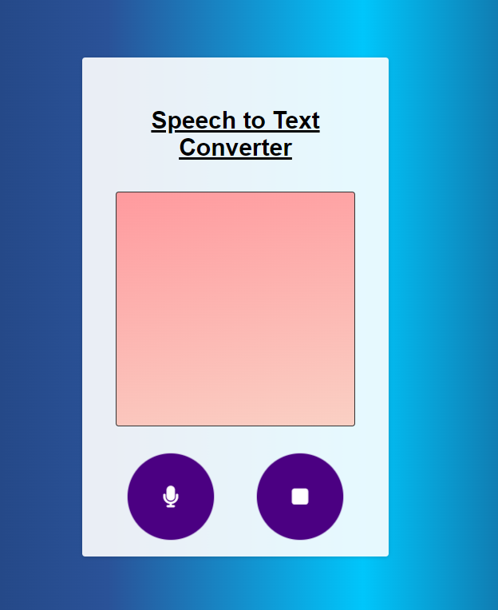

# Text-to-Speech Web App (HTML, CSS, JavaScript)
This project is a simple text-to-speech web application built with HTML, CSS, and JavaScript.
- onclick  microphone button to start converting speech to text
- onclick stop button to stop converting speech to text.
 